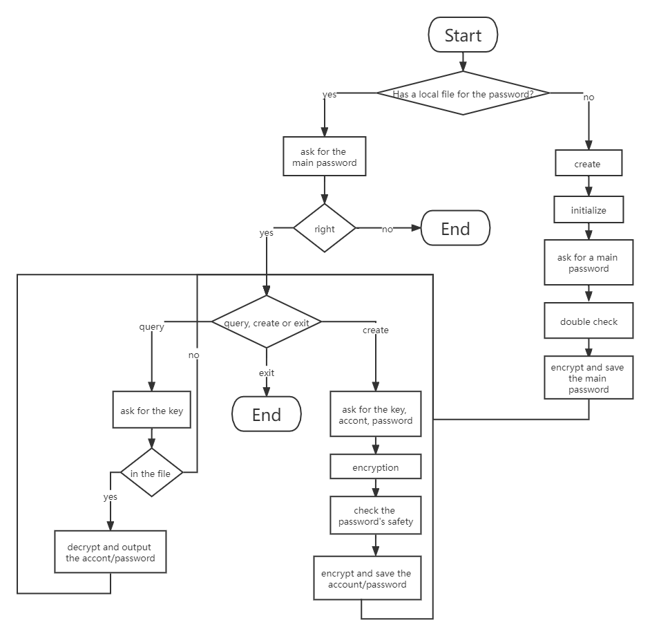

# Password Manager

## My Goal In Version 1.0

* use a local file as a database to save account/password

* initialization
  * if the file doesn't exist, creat a new file, and
  * ask for a main password (twice) to protect the file
  * check the complexity of the main password

* account/password management
  * the encryption of the account/password
  * the addition and query of the account/password
  * use a main password to ensure password security

## About The Author

* I'm Evan, an 11 year old student. I love programming, and my father teaches me Python and C++. I am writing this program because I want to manage my accounts and passwords.
  
* If you want to talk to me, here is my e-mail:
  yf.yan@icloud.com

* Welcome to join in!
